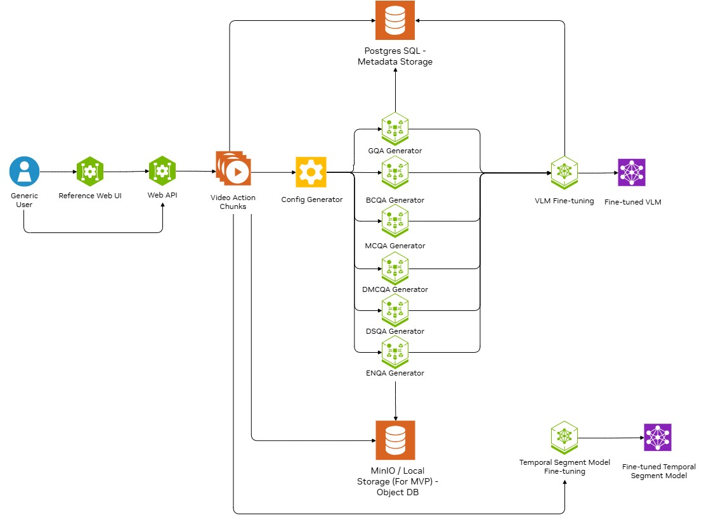

# SOP Training Service

### Table of Contents
- [Overview](#overview)
- [Repository Structure Overview](#repository-structure-overview)
- [Components](#components)
- [Prerequisites](#prerequisites)
- [Installation and Setup](#installation-and-setup)
- [Deployment Assumptions / Security Posture](#deployment-assumptions--security-posture)
- [Services](#services)
- [Microservices API Specs](#microservices-apis)
- [Customization Config](#customization-config)
- [Customization Variables](#customization-variables)
- [Tutorial](#tutorial)
- [Troubleshooting](#troubleshooting)
- [License](#license)
- [Citation and Acknowledgments](#citation-and-acknowledgments)


## Overview

SOP training service is designed to facilitate Standard Operating Procedure (SOP) monitoring in industrial manufacturing environments by leveraging vision-language models (VLMs). Its primary goal is to train a VLM capable of identifying whether operators are following the correct procedural steps during task execution, providing a foundation for automated compliance verification and operational quality assurance.
To achieve this, the application is structured into three microservices, each responsible for a critical stage in the VLM training pipeline:

1. **Video Annotation Service**: Enables users to annotate raw video footage by marking the start and end timestamps of each SOP-related action. Each annotated segment is labeled with a corresponding SOP action index and description, forming the ground truth for downstream processing.


2. **Data and QA Augmentation Service**: Transforms annotated video data into structured question-answer (QA) formats to train the VLM. This service utilizes NVIDIA LLM NIM API to do QA augmentation. This module generates different types of QA pairs:

   * **GQA (General QA)**: General questions about the video.
   * **BCQA (Binary Choice QA)**: Yes/No style questions to verify action presence or absence.
   * **MCQA (Multiple Choice QA)**: Questions with multiple possible action choices to challenge model understanding.
   * **DMCQA (Dynamic Multiple Choice QA)**: Questions with positive and negative dynamic multiple possible action choices
      * Positive: choices with correct action option
      * Negative: choices without correct action option
   * **DSQA (Dynamic Shuffling QA)**: Constructing noise video by combining frames from multiple different chunks and with questions that challenge the model verifying action absence
   * **ENQA (Extra Negative Source QA)**: Constructing noise video by adding different SOP videos into dataset and with questions that challenge the model verifying action absence


3. **VLM Fine-Tuning Service**: Fine-tunes a pretrained vision-language model on the augmented QA dataset. The trained model is then capable of analyzing unseen video sequences to assess SOP adherence in real-time or batch settings.

4. **Action Segmentation Model Fine-Tuning Service**: We fine-tune an action segmentation model (DDM-Net) using full videos and their corresponding event boundaries. The trained model segments the video by action, providing appropriate video clips for the downstream VLM action recognition task.More information is available in the DDM-Net's [README](microservices/ddm-training-ms/ddm/README.md).


SOP training BP provides a reference UI for ease of use. The UI underneath uses the 3 different microservices mentioned above.


## Repository Structure Overview
* `microservices`: Contain all source code for microservices
* `assets`: Contain all assets including pretrain weight, configs, logs, and data
* `db-init-scripts`: Contain metadata DB initialization
* `docker-compose.yml`: Local deployment config

## Components
<div align="center">
  
</div>

* Reference web UI is a React based user interface. It offers an easy to use interface that user can use to interact with the backend microservices
* The Video Action Chunks part represents the annotation microservice which would chunk input video into multiple action video chunks based on annotated start and end timestamp
* Config Generator, GQA Generator, BCQ Generator and MCQ Generator are all wrapped in the “Data / QA Augmentation” microservice. It’s responsible for generating multiple different format QAs given labelled SOP data
* VLM Fine-tuning microservice currently support [Cosmos-Reason
](https://github.com/nvidia-cosmos/cosmos-reason2). More VLMs would be supported in the future
* Action Segmentation Model currently support [DDM-Net](https://github.com/MCG-NJU/DDM) fine-tuning.
* The SOP training BP utilizes Postgres DB for storing videos, annotations and training metadata. All videos and training assets would be stored at the local file storage of the deployment server.


## Prerequisites
* Ubuntu 22.04 or later
* 4 * A100 80GB (For full-finetuning with Cosmos-Reason at reasonable batch size)
* CUDA Version 12.8.1 or above
* NVIDIA Driver 550.144.03 for A100
* NVIDIA API key to make request to NVIDIA NIM API
   * Refer to [NVIDIA NIM](https://build.nvidia.com/explore/discover) for how to get the API key


## Installation and Setup
1. Clone the repo
```
git clone <repo-url>
cd sop-training-bp-deployment
```

2. Log in NGC and docker
```
# NGC
NGC config set

# Docker
docker login nvcr.io
```

3. Create your `.env`

   The repo does **not** ship `.env` files — they are git-ignored so that your
   NGC key and database credentials are never committed. Create the deployment
   `.env` in the repo root with the content below, then replace `NGC_API_KEY`
   with your own NVIDIA API key (the one that can access the LLM NIM API):

```bash
cat > .env <<'EOF'
# NVIDIA API Key for accessing the LLM NIM API
export NGC_API_KEY=<your nvidia api key that can access LLM NIM API>

# Asset paths (host directories mounted into the containers)
export CONFIG_DIR=./assets/config
export DATASET_ROOT=./assets/data
export PRETRAINED_MODEL_ROOT=./assets/weights
export RESULTS_ROOT=./assets/results
export TOOL_PATH=./assets/tools
export LOG_FILE_ROOT=./assets/logs
export POSTGRES_DB_ROOT=./assets/metadata_db

# Postgres DB — REQUIRED (docker compose refuses to start if unset). CHANGE these before any shared / non-local deployment.
export POSTGRES_USER=sop
export POSTGRES_PASSWORD=sop
export POSTGRES_DB=sop_db

# Service hostnames + ports (used by nginx / inter-service routing)
export ANNOTATION_BACKEND_HOST=annotation-backend
export ANNOTATION_BACKEND_PORT=8100
export AUGMENTATION_BACKEND_HOST=sop-data-gen
export AUGMENTATION_BACKEND_PORT=5487
export VLM_TRAINING_BACKEND_HOST=cosmos-reason-microservice
export VLM_TRAINING_BACKEND_PORT=32080
export DDM_TRAINING_BACKEND_HOST=ddm-training-microservice
export DDM_TRAINING_BACKEND_PORT=32100
export EVAL_BACKEND_HOST=evaluation-microservice
export EVAL_BACKEND_PORT=32090
export EVAL_PORT=32090
export EVAL_IMAGE=eval_ms:latest
EOF
```

   > **Standalone microservice development:** running a microservice on its own
   > (from `microservices/<service>/` via its own `docker-compose.yml` /
   > `Makefile`) reads a local `.env` in that directory. Create one by copying
   > the relevant variables from above — the asset paths, the Postgres block,
   > and that service's port. These per-service `.env` files are git-ignored too.

4. Create assets folders to be mounted
```
mkdir assets/data assets/logs assets/metadata_db assets/results assets/weights
```

5. Download model weight. The model weight can be downloaded in [Cosmos-Reason HuggingFace repo](https://huggingface.co/collections/nvidia/cosmos-reason2)


6. Run the SOP training BP
```
docker compose up
```

> **Tuning parallel build (optional)** — The CUDA-compiling microservices
> (`cosmos-reason-microservice`, `ddm-training-microservice`,
> `evaluation-microservice`) cap parallel `nvcc` jobs via the `MAX_JOBS`
> build-arg (default `8`). On a 64-core host the default is conservative;
> bump it to use more cores, lower it on a memory-constrained host:
>
> ```bash
> # Build all services with up to 16 parallel compile jobs:
> docker compose build --build-arg MAX_JOBS=16
>
> # Or per-service:
> docker compose build --build-arg MAX_JOBS=16 cosmos-reason-microservice
> ```
>
> Why this matters: `flash-attn`, `transformer_engine`, `apex`, and the
> DDM-Net CUDA extension each spawn `MAX_JOBS` concurrent `nvcc`
> invocations whose subprocesses' page tables + RSS can aggregate past
> 500 GB and trigger global OOM. The default of 8 keeps peak under
> ~30 GB. Tune up only if you have RAM headroom.

7. Stop service
```bash
# stop service but keep volumes
docker-compose down

# remove volumes as well
docker-compose down -v
```


## Deployment Assumptions / Security Posture

> **Self-hosted, shared-responsibility distribution.** This project is distributed as **source plus reference Docker images**. NVIDIA does **not** host, operate, or manage any instance of these microservices — **you, the deploying operator, run every component in your own environment and are solely responsible for securing that deployment.** It is a **reference deployment for trusted, internal, single-tenant networks** (developer workstation, lab cluster, VPN-only host) and is **not** hardened for direct Internet exposure or multi-tenant use.

The shipped code deliberately leaves deployment-time security controls to the operator. Before any shared or production deployment, **you are responsible for implementing and enforcing the controls below.** Have your security team review the deployment, define the trust boundaries, and validate these controls.

### Operator security responsibilities

| Area | What this project ships | Your responsibility before non-local / production use |
|---|---|---|
| **API authentication & authorization** | None — every microservice API accepts any caller that can reach its port. | Enforce AuthN/AuthZ in front of all services (VPN, authenticated reverse proxy, API gateway, JWT/OAuth, or mTLS) and fail closed. |
| **Transport encryption (TLS)** | Cleartext HTTP for both client→service and service→service traffic. | Terminate TLS at a proxy and/or enable mTLS between services; never carry credentials or data over plaintext on an untrusted network. |
| **Network placement / ingress** | Service ports bind on the host with no ingress filtering. | Keep services on a private network/VPN, never bind these ports to a public interface, and restrict ingress with a firewall / security groups. |
| **CORS (browser cross-origin access)** | Every microservice API enables permissive CORS — `allow_origins=["*"]` with credentials disabled — for convenience with the same-origin nginx frontend. | Restrict `allow_origins` to your trusted frontend origin(s) for any shared / production deployment; update the `CORSMiddleware` configuration in each microservice's `app.py` so it is not left as `["*"]`. |
| **Database admin console (Adminer)** | `docker-compose.yml` ships Adminer on `:8080` for developer convenience. | Remove the `adminer` service, or restrict its published port to localhost only — in its `ports:`, change `8080:8080` to `127.0.0.1:8080:8080` (host-IP:host-port:container-port) — and place it behind authentication. |
| **Credentials & secrets** | DB credentials are **required** (no shipped default — `docker compose` fails to start if `POSTGRES_USER`/`POSTGRES_PASSWORD` are unset); the `.env` template uses dev values (`sop`/`sop`); the NGC API key is read only from `NGC_API_KEY` in your git-ignored `.env`. | Set strong, unique credentials (don't keep the `sop`/`sop` dev values); manage secrets with a vault/secrets manager in production; treat `.env` as sensitive and never commit it. |
| **Container & host isolation** | GPU services run as `root` with `ipc: host` (required for CUDA IPC and bind-mount writability; see `microservices/evaluation-ms/Dockerfile`). | Add `USER` directives / run non-root, scope IPC (`ipc: shareable`), drop unneeded capabilities, and harden the host OS. |
| **Logging, monitoring & auditing** | Application logging only; no security audit log. | Add security audit logging, monitoring, and alerting for authentication, admin, and job-control events. |
| **Availability / resource limits** | No request size, rate, or concurrency limits on the APIs. | Enforce rate / size / concurrency limits and quotas (e.g. at the reverse proxy) to mitigate DoS and resource exhaustion. |
| **Supply chain & patching** | Dependencies and base images are pinned at release. | Keep base images and dependencies patched, scan images/source for known CVEs, and verify the integrity/authenticity of pulled models and containers. |
| **Data & model integrity** | Annotation/training data is treated as trusted input from within your organization. | Vet data/annotation sources and validate the integrity and provenance of training data and produced models (poisoned data can backdoor the model). |
| **Tenancy** | **Single-tenant by design** — one trusted operator/org per deployment; no cross-tenant isolation. | Do not expose a single deployment to multiple untrusted tenants; stand up separate, isolated deployments per tenant. |

The Industrial SOP Monitoring Training Service is shared as reference and is provided "as is". The security in the production environment is the responsibility of the end users deploying it. When deploying in a production environment, please have security experts review any potential risks and threats; define the trust boundaries, implement logging and monitoring capabilities, secure the communication channels, integrate AuthN & AuthZ with appropriate access controls, keep the deployment up to date, ensure the containers/source code are secure and free of known vulnerabilities. The end users are also responsible for ensuring integrity and authenticity of the models and containers.


## Services
After setting up training BP, there would be 3 microservices running.
1. **Annotation**

   * Frontend: (`annotation-frontend`)

      * Port: 80 (configurable via `FRONTEND_PORT`)

      * Simple UI for annotation and submitting job

   * Backend: (`annotation-backend`)

      * Port: 8100 (configurable via `ANNOTATION_BACKEND_PORT`)
      
      * Handle the annotation timestamp logic

2. **Data / QA Generation** (`sop-data-gen`)

   * Port: 5487 (configurable via `AUGMENTATION_BACKEND_PORT`)
   
   * Generates GQAs, BCQAs, MCQAs, DSQA, DMCQA, ENQA data for VLM fine-tuning

      * The GQAs generation would utilize NVIDIA LLM NIM for generation

      * Requires NVIDIA API Key

3. **VLM Fine-tuning** (`cosmos-reason-microservice`)

   * Port: 32080 (configurable via `VLM_TRAINING_BACKEND_PORT`)

   * Performs Cosmos-Reason fine-tuning using generated data

   * Requires GPU access

4. **Action Segmentation Model Fine-tuning** (`ddm-training-microservice`)

   * Port: 32100 (configurable via `DDM_TRAINING_BACKEND_PORT`)

   * Performs DDM-Net fine-tuning using generated data

   * Requires GPU access

5. **Evaluation** (`evaluation-microservice`)

   * Port: 32090 (configurable via `EVAL_BACKEND_PORT`)

   * Runs by-action evaluation (VLM accuracy on segmented clips) and end-to-end evaluation (DDM segmentation + VLM action recognition)

   * Requires GPU access

6. Apart from the above microservices, the BP would initiate a DB (Postgres) and a reference DB management (Adminer) service when start up.
   *  Access to the Adminer:
      * Port: 8080
      * Server: `metadata_db`
      * Username: POSTGRES_USER
      * Password: POSTGRES_PASSWORD
      * Database: POSTGRES_DB
   * For using custom tool for access or manage metadata DB, please adjust the `docker-compose.yml` accordingly.


## Microservices APIs
1. **Annotation**: [api spec](microservices/video-annotator-ms/annotation_backend/api_spec/openapi_spec.json)

2. **Data / QA generation**: [api spec](microservices/data-generation-pipeline/api_spec/openapi_spec.json)

3. **VLM fine-tuning**: [api spec](microservices/cr-training-ms/api_spec/openapi.json)

4. **Action Segmentation Model Fine-tuning**: [api spec](microservices/ddm-training-ms/api_spec/openapi.json)

5. **Evaluation**: [api spec](microservices/evaluation-ms/api_spec/openapi.json)


## Customization Config
* `.env`: Local deployment variables (microservice ports, NGC API key, DB credentials). Not committed — create it as described in [Installation and Setup](#installation-and-setup) step 3.

* `assets/config/augment_config.yaml`: Data / QA generation config. All the generation parameters can be set here.
   * **General Config**
      * `video_extention`: Video extension to be used (recommend using mp4)

   * **BCQ (Binary QA - Yes/No question) Config**
      * `enable`: Whether to enable BCQ augmentation stage (default `true`)
      * `negative_ratio`: The positive and negative QA ratio (2.0 means there would be 1 yes QA and 2 no QA)
      * `subject`: Who conduct the SOP action
      * `exclude_action`: Action to be excluded from the BCQ generation (ex: 1_2 means action 1 and 2 would be excluded from BCQ generation)

   * **Sequential MCQ (Multiple Choices QA) Config**
      * `enable`: Whether to enable MCQA augmentation stage (default `true`)
      * `max_chunk_len`: The maximum number of actions to be included into the generated MCQ chunk (2 means the generated MCQ chunk QA would include chunk containing action 1, chunk containing action 1 + 2, but not chunk containing action 1 + 2 + 3 or more)
      * `exclude_action`: Action to be excluded from the MCQ generation (ex: 3_5_8 means action 3, 5 and 8 would be excluded from the squential MCQ generation)

   * **GQAs Config**
      * `enable`: Whether to enable GQA augmentation stage (default `true`)
      * `llm_type`: What types of LLM call to use
         * local: use local deployed LLM
         * nvidia: use NVIDIA LLM NIM API (API Key would be needed)
      * `local_llm_url`: Local LLM URL to be used for GQA augmentation
      * `llm`: NVIDIA NIM API LLM Model to be used for GQA augmentation
      * `num_qa_llm`: Number of QA pairs to be generated by LLM
      * `num_qa_per_chunk`: Number of QA pairs to sample from num_qa_llm to be the final GQA pairs
      * `exclude_action`: Action to be excluded from the GQA to GQAs generation (ex: 1_2 means action 1 and 2 would be excluded from the GQA generation)

   > The NVIDIA API key is read only from the `NGC_API_KEY` environment variable (your `.env`); it is not configurable in `augment_config.yaml`.

   * **Golden GQA**
      : Whether to enable golden GQA augmentation stage (default `true`)

   * **Dynamic MCQ**
      * `enable`: Whether to enable DMCQA augmentation stage (default: `false`)
      * `exclude_action`: Action to be excluded from the dynamic MCQ generation (ex: 1_2 means action 1 and 2 would be excluded from the DMCQA generation)
      * `non_sop_action`: Action index of non-SOP action option (This must be set)
         * non-SOP action option is the action option like "none of the above", "doing action not belong to the defined SOP", etc.
      * `min_options`: Minimum number of options (need to adjust according to the number of actions)
      * `max_options`: Maximum number of options (need to adjust according to the number of actions)
      * `num_pos`: Number of positive samples
      * `num_neg`: Number of negative samples

   * **Dynamic Shuffling QA**
      * `enable`: Whether to enable DSQA augmentation stage (default: `false`)
      * `exclude_action`: Action to be excluded from the dynamic shuffling QA generation (ex: 1_2 means action 1 and 2 would be excluded from the DSQA generation)
      * `non_sop_action`: Action index of non-SOP action option (This must be set)
         * non-SOP action option is the action option like "none of the above", "doing action not belong to the defined SOP", etc.
      * `min_distractor`: Minimum number of distractor videos
      * `max_distractor`: Maximum number of distractor videos
      * `num_runs`: Number of runs for dynamic shuffling

   * **Extra Negative Data QA**
      * `enable`: Whether to enable ENQA augmentation stage (default: `false`)
      * `exclude_action`: Extra negative source data action to be excluded from the ENQA generation (ex: 1_2 means action 1 and 2 from extra dataset would be excluded from the ENQA generation)
      * `extra_negative_data_id`: ID of the other labeled data to be used as extra negative data (This must be set)
      * `non_sop_action`: Base data action index of non-SOP action option (This must be set)
         * non-SOP action option is the action option like "none of the above", "doing action not belong to the defined SOP", etc.
      * `min_options`: Minimum number of options (need to adjust according to the number of actions)
      * `max_options`: Maximum number of options (need to adjust according to the number of actions)
      * `num_runs`: Number of runs for ENQA generation
      * `generate_all_options`: Generate all options QA for extra negative
* `assets/config/train_config.toml`: Cosmos-Reason fine-tuning config. Training parameters such as epoch, learning rate, and pretrained model path can be set in this config. Please refer to [Cosmos-Reason](https://github.com/nvidia-cosmos/cosmos-reason2) for more config details. The parameters listed below are handled by the microservice under the hood. No need to modify this manually.
   * `train.output_dir`
   * `logging.experiment_name`
   * `train.train_policy.dataset.name`
   * `train.train_policy.dataset.split`

   Custom vision parameters for training can be set under [custom.vision]. All the supported vision config can be found in [cosmos_reason2_utils](https://github.com/nvidia-cosmos/cosmos-reason2/blob/c9301793ffa3830a2a2f061d96a991d5f7c9ac38/cosmos_reason2_utils/cosmos_reason2_utils/vision.py#L34)


* `assets/config/ddm_train_config.yaml`: DDM-Net (Action Segmentation Model) fine-tuning config. Training parameters including the number of epochs, batch size, learning rate, optimizer settings, model/backbone type, and pretrained weights can all be adjusted in this file. The config includes three sections:
   * `[dataset_config]`: Controls data-related settings such as resolution, frames_per_side, batch size, dataset paths (`train_config`, `val_config`), and video decoding backend.
   * `[model_config]`: Configure model architecture, backbone choice, and whether to use pretrained weights.
   * `[training_config]`: Set optimizer (adamw, adam, sgd), learning rate, weight decay, training epochs, evaluation metrics, gradient clipping, mixed precision, model EMA, logging intervals, checkpointing, distributed training strategy, and output path.
   
   For details on each parameter, see the information provided in [DDM-Net config's README](microservices/ddm-training-ms/ddm/DDM-Net/config/config_guide.md).

   
   The parameters listed below are handled by the microservice under the hood. No need to modify this manually.
   * `dataset_config.train_config.anno_path`
   * `dataset_config.train_config.data_root`
   * `dataset_config.val_config.anno_path`
   * `dataset_config.val_config.data_root`
   * `raining_config.output`
   * `raining_config.exp_name`


## Customization Variables
* Refer to [here](microservices/video-annotator-ms/annotation_backend/utils/constant.py) for all annotation related environment variables
* Refer to [here](microservices/data-generation-pipeline/utils/constant.py) for all QA / data generation related environment variables
* Refer to [here](microservices/cr-training-ms/utils/constant.py) for all Cosmos-Reason training related environment variables
   * The service use custom dataset `./assets/tools/cosmos_custom_dataset.py` and config `./assets/config/train_config.toml` for Cosmos-Reason fine-tuning. If you want to use different custom dataset or config, add environment variable `CUSTOM_DATASET_NAME` for custom dataset and `TRAIN_CONFIG_NAME` for config to the docker-compose.yml env section of `cosmos-reason-microservice`.
* Refer to [here](microservices/ddm-training-ms/utils/constant.py) for all Action Segmentation Model (DDM-Net) training related environment variables.
   * The service use config `./assets/config/ddm_train_config.yaml` for DDM-Net fine-tuning. If you want to use different config, add environment variable `TRAIN_CONFIG_NAME` for config to the docker-compose.yml env section of `ddm-training-microservice`.

## Tutorial
This service provide a [tutorial notebook](tutorials/sop_monitoring_training_flow.ipynb) for illustrating the usage via API calls.

There's detail information for each microservices in below README
1. [Annotation](microservices/video-annotator-ms/README.md)
2. [Data / QA Generation](microservices/data-generation-pipeline/README.md)
3. [VLM Fine-tuning](microservices/cr-training-ms/README.md)


## Troubleshooting

- Ensure you have Docker and Docker Compose installed
- Verify GPU drivers and nvidia-docker are properly configured
- Check that all required NGC credentials are set in the `.env` file
- Ensure the required directories exist and have proper permissions

## License
This project is dual-licensed: source code under [Apache-2.0](https://www.apache.org/licenses/LICENSE-2.0) and documentation under [CC-BY-4.0](https://creativecommons.org/licenses/by/4.0/), per the `CC-BY-4.0 AND Apache-2.0` terms in the [`LICENSE`](./LICENSE) file.

This project bundles and/or downloads third-party open-source software, each under its own license. The vendored DDM-Net training code (`microservices/ddm-training-ms/ddm/` and `microservices/evaluation-ms/ddm/`) is licensed under the MIT License — see [`../../THIRD_PARTY_NOTICES.md`](../../THIRD_PARTY_NOTICES.md). Review the license terms of any additionally downloaded open-source projects before use.

## Citation and Acknowledgments

This project incorporates code from the following open-source repositories:

- **DDM-Net**: [MCG-NJU/DDM](https://github.com/MCG-NJU/DDM) - Generic event boundary detection for action segmentation

If you use this SOP training system in your research, please acknowledge the DDM-Net contribution by citing:

```bibtex
@InProceedings{Tang_2022_CVPR,
    author    = {Tang, Jiaqi and Liu, Zhaoyang and Qian, Chen and Wu, Wayne and Wang, Limin},
    title     = {Progressive Attention on Multi-Level Dense Difference Maps for Generic Event Boundary Detection},
    booktitle = {Proceedings of the IEEE/CVF Conference on Computer Vision and Pattern Recognition (CVPR)},
    month     = {June},
    year      = {2022},
    pages     = {3355-3364}
}
```